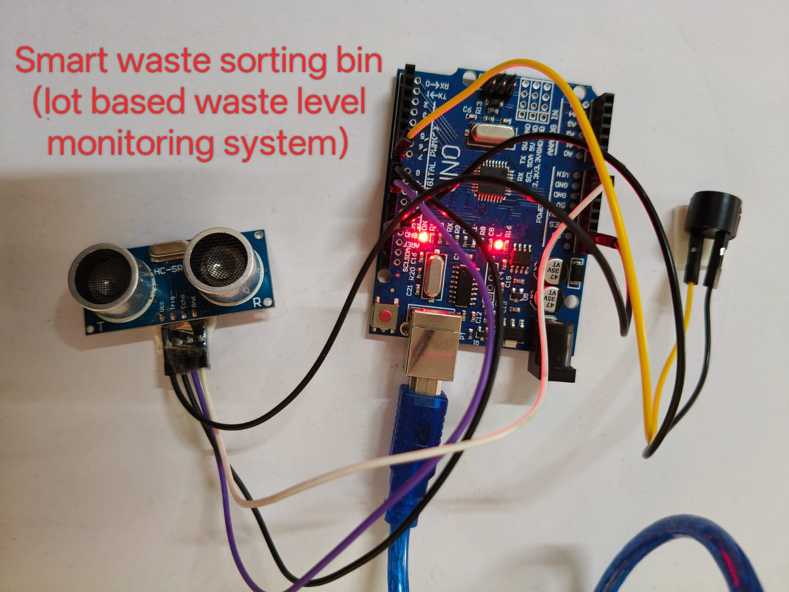

🛰️ Smart Bin Level Monitoring System
Using Arduino, Ultrasonic Sensor, Buzzer & SMS Alerts via Twilio API

📌 Project Overview

This IoT-based Smart Bin Monitoring System measures the fill level of a waste bin using an ultrasonic sensor.
When the bin becomes full, the system triggers:

Real-time readings on Serial Monitor

SMS alert to mobile using Twilio API

Buzzer alert

The system is simple, reliable, and does not require Wi-Fi—only Arduino and a computer running a Twilio Python script.

🚀 Features

⏱️ Real-time ultrasonic distance measurement

🔊 Local buzzer alert

📩 SMS notifications via Twilio

💻 Serial Monitor output

🪶 Lightweight Arduino code (no cloud / no ML)

🌐 Works offline

🛠️ Hardware Components

Arduino UNO / Mega

HC-SR04 Ultrasonic Sensor

Buzzer

Jumper wires

USB cable (for serial communication)

🔧 Hardware Wiring Diagram

🟦 Ultrasonic Sensor → Arduino
Ultrasonic Pin	Arduino Pin
VCC	5V
GND	GND
TRIG	D9
ECHO	D10
🔊 Buzzer → Arduino
Buzzer Pin	Arduino Pin
+	D8
-	GND
📤 Output Types Included
✔️ 1. Serial Monitor Output

Displays:

Live bin-level distance

“BIN FULL” message when threshold is crossed

Figure X.X – Arduino Serial Monitor showing real-time bin level readings and FULL detection message.

✔️ 2. SMS Alert via Twilio

When Arduino sends "FULL" through Serial, the Python script automatically sends:

“Alert! Waste bin is FULL. Please clean.”

✔️ 3. Buzzer Alert

Buzzer turns ON when bin is full.

📁 Project File Structure (Single-Level Files)
smart_bin.ino             # Arduino code for ultrasonic sensor + buzzer + serial output
serial_to_twilio.py       # Python script: reads serial, sends SMS via Twilio
wiring_diagram.png        # Your original hardware wiring/model image
README.md                 # Project documentation

📡 System Workflow (Serial → Python → Twilio → User)
Ultrasonic Sensor → Arduino → Serial Output → serial_to_twilio.py → Twilio API → User Phone

📦 Software Requirements

Arduino IDE

Python 3

pySerial (pip install pyserial)

Twilio SDK (pip install twilio)

Twilio Account (SID, Auth Token, Phone Number)

▶️ How to Run the Project
1. Upload Arduino Code

Open smart_bin.ino → Upload using Arduino IDE.

2. Run the Python Script

Start the script:

python serial_to_twilio.py

It continuously listens to USB serial.

When FULL is detected → SMS is sent.

📞 Twilio Configuration

Create a Twilio account

Get:

ACCOUNT SID

AUTH TOKEN

TWILIO PHONE NUMBER

Place them inside serial_to_twilio.py

📚 Applications

Smart waste management systems

Industrial bins and containers

Hospitals and campuses

Public waste bins

Smart city automation
